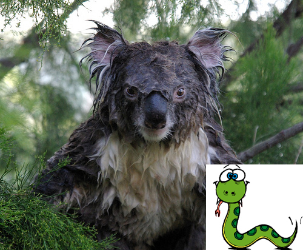

!SLIDE

# GC & Object allocation Changes #

!SLIDE smaller

## Never create Ruby strings longer than 23 characters ##

!SLIDE

    @@@ c
    struct RString {
      struct RBasic basic;
      long len;
      char *ptr;
      union {
        long capa;
        VALUE shared;
      } aux;
    };

!SLIDE

    @@@ c
    struct RString {
      struct RBasic basic;
      union {
        struct {
          long len;
          char *ptr;
          union {
            long capa;
            VALUE shared;
          } aux;
        } heap;
        char ary[RSTRING_EMBED_LEN_MAX + 1];
      } as;
    };

!SLIDE

    @@@ c
    VALUE ary[RARRAY_EMBED_LEN_MAX];

!SLIDE
    @@@ c
    VALUE ary[ROBJECT_EMBED_LEN_MAX];
    
!SLIDE

!SLIDE
## Wake up ##

!SLIDE smaller

 
*reference to languages living or dead is accidental* 

!SLIDE smaller
## Lazy sweep GC ##

* Ruby has Mark & Sweep garbage collector. 
* Mark phases marks the active objects and sweep phase collects all the unmarked objects.
* Lazy sweep GC, sweeps only until it finds a free slot. It may mean bad worst case peformance.

